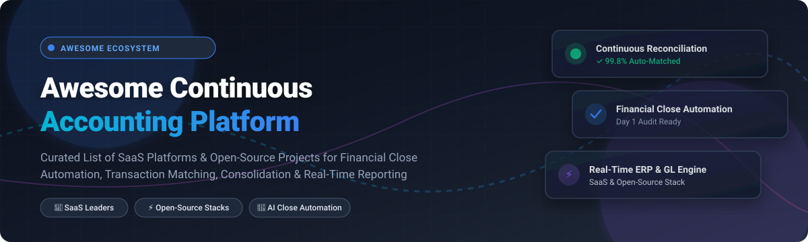

# ⚡ Awesome Continuous Accounting Platform 📊

      

  

## 🚀 Overview & Ecosystem Summary

Welcome to the definitive **Continuous Accounting Platform Ecosystem** reference guide! This curated directory features top-tier **SaaS Continuous Close Software** and production-ready **Open-Source Accounting Engines**. 

**Continuous accounting** transforms corporate finance by shifting month-end close operations into automated daily routines—leveraging real-time general ledger (GL) sync, automated transaction reconciliation, AI-assisted accrual management, and instant consolidated financial reporting.

---

## 📑 Table of Contents
- [🏢 SaaS/Hosted Platforms](#-saashosted-platforms)
- [💻 Open-Source GitHub Projects](#-open-source-github-projects)
- [🛠️ Continuous Accounting Architecture & Integration](#%EF%B8%8F-continuous-accounting-architecture--integration)
- [🤝 How to Contribute](#-how-to-contribute)
- [💖 Support & Sponsorship](#-support--sponsorship)
- [⚠️ Disclaimer](#%EF%B8%8F-disclaimer)
- [📈 Star History](#-star-history)

---

## 🏢 SaaS/Hosted Platforms

> **📊 Sector Market Size & Market Structure**: The global **Financial Close Automation & Continuous Accounting Software Market** is estimated at **~$4.5 Billion USD in 2026** (projected to reach ~$10.8 Billion by 2032 at a CAGR of 13.5%). The market is **moderately fragmented**: incumbent corporate performance management (CPM) and close management giants like *Workiva*, *BlackLine*, and *OneStream* hold substantial enterprise market share, while fast-growing AI-native disruptors like *Numeric*, *Rillet*, and *Campfire* are capturing mid-market and startup accounting workflows.

Below is a comprehensive comparison of leading SaaS continuous close and financial reporting platforms, sorted by estimated company size (revenue/valuation) descending.

| 🏢 Platform | 📝 Overview & Core Features | 💰 Estimated Company Size (Rev / Val) | 💵 Starting Tier Pricing | 🎁 Free Tier / Free Trial Limits |
| :--- | :--- | :--- | :--- | :--- |
| **[Workiva](https://www.workiva.com/)** | Enterprise platform for SEC filings, ESG, iXBRL tagging, financial reporting, and multi-entity consolidation with real-time audit logs. | **~$630M+ Annual Revenue** (~$4.5B Market Cap) | Starts at **$1,200 / month** ($14,400/yr base contract) | ❌ No free tier. Offers **14-day guided sandbox access** upon enterprise demo request. |
| **[BlackLine](https://www.blackline.com/)** | Market-leading financial close suite offering automated transaction matching, account reconciliations, journal entry management, and intercompany accounting. | **~$600M+ Annual Revenue** (~$3.5B Market Cap) | Starts at **$1,500 / month** ($18,000/yr enterprise base) | ❌ No free tier. Offers **14-day enterprise test-drive sandbox** for qualified finance teams. |
| **[OneStream](https://www.onestream.com/)** | Unified Corporate Performance Management (CPM) software unifying financial close, consolidation, planning, budgeting, and operational reporting. | **~$450M+ ARR** (~$6.0B Market Cap) | Enterprise CPM starts at **$2,500 / month** ($30,000/yr base) | ❌ No free tier. Provides **custom interactive demo environment** for enterprise buyers. |
| **[Trintech](https://trintech.com/)** | Enterprise close management and reconciliation software providing automated matching (Adra & Cadency suites) and close task tracking. | **~$180M+ Annual Revenue** (~$1.0B Valuation) | Adra Suite starts at **$750 / month** ($9,000/yr base) | ❌ No free tier. Offers **14-day full feature free trial** of the Adra suite. |
| **[FloQast](https://floqast.com/)** | AI-assisted close management platform specializing in checklist automation, continuous reconciliation workflows, flux analysis, and ERP sync. | **~$100M+ ARR** ($1.6B+ Series E Valuation) | Starts at **$1,000 / month** ($12,000/yr annual commitment) | ❌ No free tier. Provides **14-day guided interactive trial** for accounting ops teams. |
| **[Vena](https://venasolutions.com/)** | Excel-native FP&A and close management platform connecting Excel interfaces directly to centralized GL databases and financial report builders. | **~$90M+ ARR** (~$450M Valuation) | Professional tier starts at **$1,200 / month** ($14,400/yr) | ❌ No free tier. Offers **14-day interactive test-drive trial** with pre-populated datasets. |
| **[Cube](https://cubesoftware.com/)** | Spreadsheet-native financial planning & close automation tool seamlessly mapping Excel/Google Sheets to NetSuite, QuickBooks, and Sage Intacct. | **~$25M+ ARR** (~$120M Valuation) | Starter plan begins at **$1,250 / month** ($15,000/yr paid annually) | ❌ No free tier. Offers **14-day product sandbox trial** with sample ERP connector setup. |
| **[Numeric](https://www.numeric.io/)** | AI-first continuous close platform sitting atop NetSuite, Sage, and QuickBooks. Automates accrual review, transaction matching, and flux variance. | **~$20M+ ARR** ($150M+ Series A Valuation) | **Free Tier available**; Pro tier starts at **$500 / month** | ⚡ **Free Forever Plan**: Up to 3 user seats, standard account reconciliations & basic ERP sync. |
| **[Rillet](https://www.rillet.com/)** | AI-native ERP replacing traditional GL workflows with real-time subledger posting, continuous bank feeds, and automated monthly revenue recognition. | **~$8M+ ARR** (~$70M Series A Valuation) | Starter ERP tier begins at **$600 / month** ($7,200/yr) | ❌ No free tier. Includes **14-day guided onboarding trial** with trial ledger migration. |
| **[Campfire](https://campfire.ai/)** | Modern startup ERP and continuous accounting platform featuring Ember AI for real-time transaction classification and multi-currency ledgers. | **~$6M+ ARR** (~$50M Valuation) | Startup tier starts at **$350 / month** ($4,200/yr) | 🆓 **14-Day Free Trial**: Full access to Ember AI ledger & trial balance features. |

---

## 💻 Open-Source GitHub Projects

Explore top open-source double-entry engines, programmable ledger infrastructures, and automated reporting toolkits. Each project is ranked by GitHub star count (descending) with direct links to repo stargazers.

| 📦 Repository & Name | 🏷️ Category | 📝 Description & Technical Highlights | ⭐ GitHub Star Count & Stargazers Link |
| :--- | :--- | :--- | :--- |
| **[frappe/erpnext](https://github.com/frappe/erpnext)** | Full ERP & GL System | Full-featured open-source ERP system built on Python/JS. Includes complete general ledger, automated journal entries, bank reconciliations, multi-company consolidation, and financial statements. |  |
| **[firefly-iii/firefly-iii](https://github.com/firefly-iii/firefly-iii)** | Financial Manager | PHP-based personal and SMB finance manager featuring rule-based automated transaction importing, budget tracking, continuous ledger reconciliation, and custom reporting. |  |
| **[akaunting/akaunting](https://github.com/akaunting/akaunting)** | Accounting Software | Open-source double-entry accounting software built with Laravel & VueJS. Features invoicing, expense tracking, bank feeds, multi-currency ledger, and financial reporting. |  |
| **[ledger/ledger](https://github.com/ledger/ledger)** | Command-Line GL | Powerful C++ command-line double-entry accounting engine using plain-text inputs. The foundation for programmable, Git-auditable continuous ledger workflows. |  |
| **[beancount/beancount](https://github.com/beancount/beancount)** | Plain-Text Accounting | Double-entry accounting system using plain-text syntax and an SQL-like query interface. Ideal for programmatic transaction auditability, real-time balance sheets, and custom continuous close scripts. |  |
| **[gnucash/gnucash](https://github.com/gnucash/gnucash)** | Desktop Accounting | Mature C/C++ cross-platform financial accounting application featuring double-entry transaction tracking, scheduled transactions, reconciliation tools, and financial reporting. |  |
| **[formancehq/ledger](https://github.com/formancehq/ledger)** | Cloud-Native Ledger | Cloud-native, programmable double-entry ledger engine written in Go. Built for complex financial transaction routing, atomic postings, payment orchestration, and real-time reconciliation. |  |
| **[blnkfinance/blnk](https://github.com/blnkfinance/blnk)** | Ledger & Reconciliation | Open-source financial infrastructure engine in Go. Features multi-currency double-entry ledgers, atomic transaction rollbacks, and configurable automated transaction matching rules. |  |
| **[cybermaggedon/ixbrl-reporter](https://github.com/cybermaggedon/ixbrl-reporter)** | Regulatory Reporting | Python tool for automated programmatic creation of inline XBRL (iXBRL) financial report files from account templates and ledger data. |  |
| **[rhamenator/BrassLedger](https://github.com/rhamenator/BrassLedger)** | .NET Accounting Suite | Open-source cross-platform .NET desktop accounting application providing general ledger workspaces, cash application, payables disbursement, and financial statement generation. |  |
| **[aferryc/yars](https://github.com/aferryc/yars)** | Bank Matching Microservice | Event-driven Go microservice using Kafka & PostgreSQL to match bank statements against internal company transaction records. |  |
| **[azaharizaman/nexus-accounting](https://github.com/azaharizaman/nexus-accounting)** | Consolidation Package | PHP 8.3+ package for automated financial statement generation, multi-entity consolidation, and flux variance analysis. |  |

---

## 🛠️ Continuous Accounting Architecture & Integration

To build a modern **open-source continuous accounting pipeline**, software architects and finance operations teams often combine modular tools:

1. **Core Ledger Engine**: Use **Beancount** or **Ledger CLI** for version-controlled plain-text general ledger storage, or **Formance Ledger** / **Blnk** for microservice transaction streaming.
2. **Reconciliation & Matching**: Leverage **Blnk** or **YARS** for automated bank statement to internal ledger matching and anomaly detection.
3. **ERP & Workflow Core**: Deploy **ERPNext** or **Akaunting** for core payables, receivables, and vendor management.
4. **Automated Regulatory Reporting**: Use **ixbrl-reporter** to transform period ledger outputs into audit-compliant SEC/iXBRL financial statements.

---

## 🤝 How to Contribute

Contributions are welcome and appreciated! Follow these steps to submit a new SaaS platform or open-source continuous accounting project:

1. **Fork** this repository.
2. Add your project to `README.md` in alphabetical or sorted position (following the existing table format).
3. Ensure to include: Project Name, Official URL, Factual Capabilities, Pricing/Stars, and Category.
4. Open a **Pull Request** with a brief summary of the added tool.

Please ensure all added resources are directly relevant to continuous accounting, close management, reconciliation, or double-entry financial ledgers.

---

## 💖 Support & Sponsorship

If you find this curated continuous accounting repository helpful for your finance engineering, accounting operations, or software architecture work, please consider supporting the project!

- ⭐ **Star this repository** to help others discover it!
- 🔀 **Fork it** to customize your own internal financial software stack reference.
- 📢 **Share** with colleagues on LinkedIn, Twitter/X, and financial engineering communities.
- ☕ **Buy me a coffee / Sponsor**: Support ongoing maintenance and curated financial open-source updates via the [GitHub Sponsors Dashboard](https://github.com/sponsors/ishandutta2007).

---

## ⚠️ Disclaimer

- This repository is a **community-curated index** for informational and research purposes only. It does not constitute financial, legal, or audit advice.
- Continuous accounting systems process sensitive financial records; always perform thorough security, SOC 1/SOC 2 compliance, and internal audit reviews before deploying any commercial software or open-source library into production.

---

## 📈 Star History

